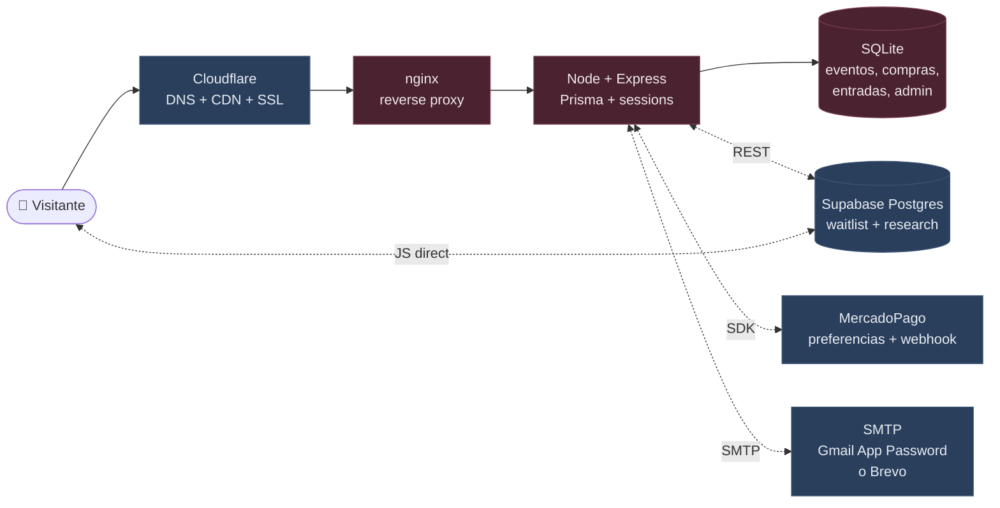
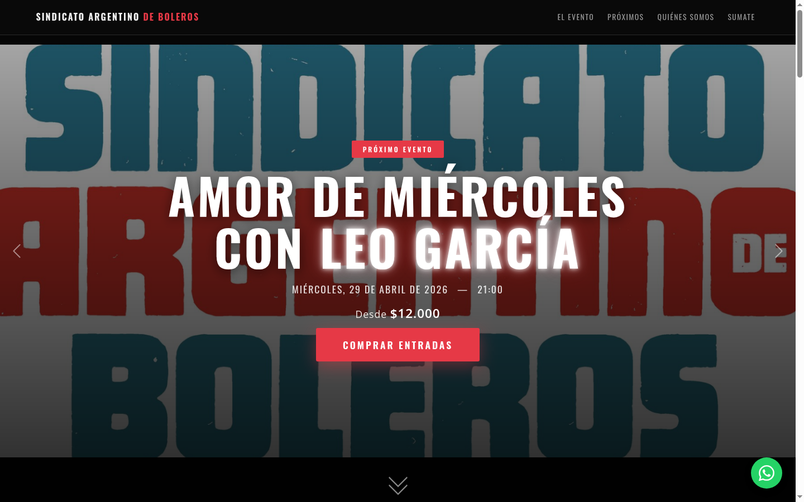
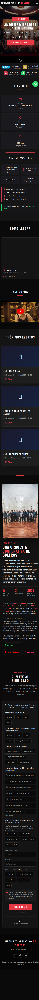
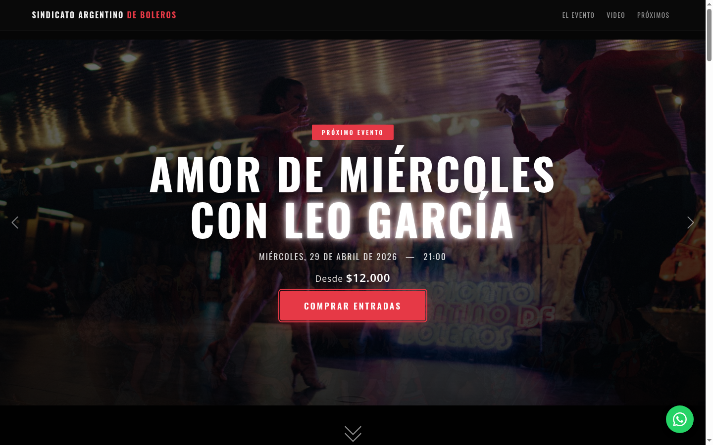
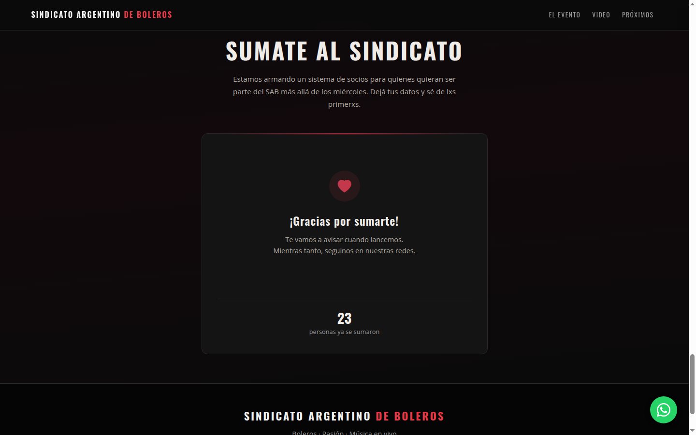
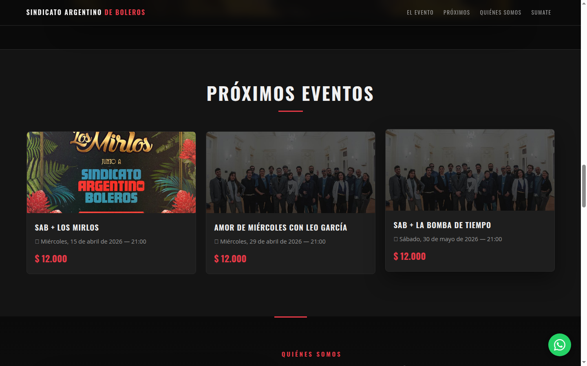

# SAB Landing

[](LICENSE)
[](https://github.com/martinlleral/sab-landing/commits/main)
[](https://github.com/martinlleral/sab-landing)
[](https://github.com/martinlleral/sab-landing)
[](https://sindicatoargentinodeboleros.com.ar/)

Landing page + ticketera propia + sistema de suscripciones para el **Sindicato Argentino de Boleros**, orquesta cooperativa de 21 músicos y músicas de La Plata, Argentina.

> **Basado en el trabajo original de Luciano Menez** ([@lucianomenez](https://gitlab.com/lucianomenez) en GitLab), quien desarrolló el stack completo de la ticketera en 2025. Este repositorio es la continuación del proyecto: mantenimiento, extensiones y migración a infraestructura propia del SAB a partir de 2026.

Sitio en producción: [sindicatoargentinodeboleros.com.ar](https://sindicatoargentinodeboleros.com.ar)
Instagram: [@sindicatoargentinodeboleros](https://www.instagram.com/sindicatoargentinodeboleros/)

---

## Historia del proyecto

Este proyecto es un ejemplo concreto de **trabajo colaborativo en capas**:

- **2025** — Luciano Menez desarrolla desde cero la ticketera propia del SAB: Node.js + Express + Prisma + SQLite, integración MercadoPago, generación de QR únicos antifraude, sistema de mails transaccionales, backoffice admin completo con CMS de home/eventos, lector de QR en puerta, y pipeline de deploy con Docker + GitLab CI. Lucho hace todo esto **de onda** (pro bono) como aporte al SAB — un trabajo serio que evitó que el sindicato tuviera que pagar comisiones de Passline/Eventbrite y le dio independencia tecnológica real.

- **Abril 2026** — El proyecto pasa a manos de Martín Lleral, que toma el mantenimiento + extensiones como parte de un Sprint 2: agregar sistema de suscripciones, waitlist con encuesta de research, fixes de seguridad y accesibilidad, migración de infraestructura a una cuenta DigitalOcean propia del SAB, y publicación del código como open source con licencia MIT.

La mayor parte del código de la ticketera — el corazón funcional del sistema — es obra de Lucho. Las extensiones de este repo (waitlist, sección "Quiénes somos", fixes de seguridad, runbook de deploy, auditorías) son contribuciones posteriores de Martín. Ambos trabajos existen en el mismo árbol y ambas autorías están reconocidas en el [`LICENSE`](LICENSE).

Las extensiones del Sprint 2 fueron desarrolladas usando [Claude Code](https://claude.ai/code) (Anthropic) como co-autor técnico. Las decisiones de diseño, prioridades de seguridad y research son de Martín; la ejecución de código, refactors y documentación técnica fueron producidos en pares humano-AI. Cada commit tiene coautoría explícita (`Co-Authored-By: Claude`).

Publicamos bajo MIT License con el espíritu de que **otras cooperativas musicales argentinas o latinoamericanas puedan adaptar este sistema para sus propios ciclos**, sin tener que reconstruir desde cero lo que Lucho ya dejó muy bien hecho.

---

## Qué hace esta aplicación

Es una landing con ticketera propia (sin Passline ni Eventbrite) que le permite al sindicato:

- Mostrar los shows próximos del ciclo **Amor de Miércoles** y giras externas
- Vender entradas online con QR único por entrada (sistema antifraude)
- Cobrar directo a la cuenta MercadoPago del SAB (sin comisiones intermedias: **ahorro estimado de $6-8M/año** vs. plataformas de ticketera externas)
- Enviar el QR al mail del comprador automáticamente
- Validar entradas en la puerta del show con cámara o ingreso manual
- Capturar contactos para un futuro sistema de socios (waitlist con encuesta de research)
- Gestionar eventos, flyers y contenido desde un backoffice propio

## Stack

| Capa | Tecnología |
|---|---|
| Runtime | Node.js 20 + Express 4 |
| ORM | Prisma 5 |
| Base de datos | SQLite (archivo local, sin servidor separado) |
| Frontend | HTML + Bootstrap 5.3 + JavaScript vanilla |
| Mails transaccionales | Gmail SMTP (o Brevo) |
| Pagos | MercadoPago SDK v2 |
| QR | `qrcode` (librería Node) |
| Auth | `express-session` + `bcryptjs` |
| Upload de imágenes | `multer` |
| Captura de research | Supabase (Postgres) para waitlist de socios |
| Reverse proxy / SSL | Nginx + Let's Encrypt |
| Contenedores | Docker + Docker Compose |
| Hosting | DigitalOcean droplet básico ($4/mes) |

### Arquitectura



**Dos planos de datos:** (a) las entradas y el flujo transaccional de MP viven en SQLite del droplet — control total, sin dependencias externas de estado. (b) la waitlist + encuesta de research vive en Supabase — escalabilidad automática + RLS para PII, escritura directa desde el browser con anon key embebido (verificado el 15/4: SELECT desde anon devuelve `[]` por RLS, count enumeration bloqueada por `*/0`).

## Correr en local

### Prerequisitos

- Docker Desktop con integración WSL2 (en Windows) o Docker nativo (Linux/Mac)

### Quick start

```bash
git clone git@github.com:martinlleral/sab-landing.git
cd sab-landing

cp .env.example .env
# Editar .env con credenciales locales de MercadoPago, SMTP, etc.

docker compose up -d
```

El sitio queda en [http://localhost:3000](http://localhost:3000).
El backoffice en [http://localhost:3000/backoffice/login.html](http://localhost:3000/backoffice/login.html).

Las credenciales del admin se generan la primera vez con las variables `ADMIN_EMAIL` y `ADMIN_PASS` del `.env` — rotarlas inmediatamente después del primer login.

## Estructura del proyecto

```
sab-landing/
├── src/
│   ├── server.js              entry point Express
│   ├── routes/                rutas API + backoffice HTML
│   ├── controllers/           lógica de cada endpoint
│   ├── services/              integraciones MercadoPago, SMTP, QR
│   ├── middleware/            auth, upload, validación
│   └── utils/                 helpers (Prisma client, etc.)
├── prisma/
│   ├── schema.prisma          modelo de datos
│   ├── seed.js                usuario admin bootstrap (ADMIN_EMAIL/ADMIN_PASS)
│   └── migrations/            historial de cambios del schema
├── public/
│   ├── index.html             landing page
│   ├── backoffice/            panel admin
│   └── assets/                CSS, JS, imágenes estáticas
├── nginx/
│   └── app.conf               reverse proxy config
├── docs/
│   ├── runbook-deploy.md      runbook completo de deploy (6 fases)
│   ├── TODO-deploy.md         deuda técnica catalogada por prioridad
│   ├── auditoria-playwright-*.md   auditorías de UX/A11y/performance
│   ├── env.example.clean      template de variables
│   └── audit/                 capturas de pantalla de auditorías
├── docker-compose.yml         build-en-servidor + healthcheck + mem limits
├── Dockerfile                 imagen Node + Prisma
├── entrypoint.sh              migrate + seed + start
└── .env.example               template (copiar a .env, NO commitear)
```

## Deploy a producción

Todo el proceso está documentado en [`docs/runbook-deploy.md`](docs/runbook-deploy.md). Cubre:

1. **Fase 0 — Rotación de secrets** (MP, Brevo, Gmail, admin)
2. **Fase 1 — Crear droplet + hardening** (SSH key only, UFW, fail2ban, Docker)
3. **Fase 2 — Deploy del código** (rsync, build, seed, datos iniciales)
4. **Fase 3 — SSL + dominio** (Cloudflare, nameservers, Let's Encrypt)
5. **Fase 4 — SPF/DKIM/DMARC** (mails no caen en spam)
6. **Fase 5 — Monitoreo + cleanup**

El runbook está pensado para ejecutar copy-paste sin pensar.

## Testing E2E

El proyecto incluye una suite de tests end-to-end con [Playwright](https://playwright.dev) que corre contra cualquier ambiente (local o producción):

```bash
# Correr la suite completa contra producción (3 viewports: desktop, mobile, tablet)
npm run test:e2e

# Modo UI interactivo (browser visible, time-travel debug, re-run)
npm run test:e2e:ui

# Abrir el último HTML report
npm run test:e2e:report

# Apuntar a otro ambiente (por default apunta a sindicatoargentinodeboleros.com.ar)
SMOKE_TARGET=http://localhost:3000 npm run test:e2e
```

**Qué cubre:**

| Spec | Cobertura |
|---|---|
| `01-navigation` | Home + links nav + healthz + favicon |
| `02-responsive` | Overflow horizontal, touch targets WCAG, grid adaptativo |
| `03-compra` | API crearPreferencia + validaciones 400/404 + modal |
| `04-waitlist` | Sección, formulario, contador Supabase RPC |
| `05-backoffice` | Login page + redirect sin sesión + 401 en API admin |
| `06-a11y` | axe-core sobre home + login (WCAG 2.1 AA serious/critical) |
| `07-seo` | meta/OG/Twitter Card/Schema MusicGroup/canonical/robots |

**Tests del backoffice completos** (login con credenciales, navegación autenticada) requieren env vars:

```bash
export SMOKE_ADMIN_EMAIL=admin@tudominio.com
export SMOKE_ADMIN_PASS=...
npm run test:e2e
```

Sin estas variables, los tests de login se skipean (no fallan).

**Smoke test específico del rate limiter:**

```bash
npm run test:smoke:ratelimit
```

## Deuda técnica pendiente

Ver [`docs/TODO-deploy.md`](docs/TODO-deploy.md) para la lista completa catalogada por prioridad.

## Auditorías y research

El Sprint 2 incluyó una auditoría técnica completa con Playwright sobre el sitio en producción: **40 validaciones, 27 capturas de pantalla, 3 auditorías paralelas de expertos** (UX/UI, Frontend, Usuario final, SRE, Application Security, Technical Writer, OSS advocate). El reporte completo vive en [`docs/auditoria-playwright-20260410.md`](docs/auditoria-playwright-20260410.md). Abajo, una selección curada de evidencia visual.

### El producto en producción



Fotos reales del SAB (Konex, teatro, baile neón), precio visible en el hero, invitado especial resaltado con efecto glow, tarjetas de información con íconos temáticos. Screenshot capturado en el droplet nuevo del SAB el 14/4/2026 después del deploy.

### Responsive mobile



Breakpoints específicos para `<400px` (grillas 2→1 columna), info cards apiladas, navbar con menú hamburguesa. Validado en mobile 390, mobile-sm 360, tablet 768 y desktop 1440.

### Accesibilidad — navegación por teclado



Todos los controles interactivos (botones, links, inputs, radios del waitlist) tienen un `focus-visible` con borde carmín y contraste WCAG AA. La captura evidencia un tab order predecible desde el nav hasta el footer, sin trampas de foco. Los `aria-label` fueron agregados en la auditoría del 10/4 para los controles del carousel y los links sociales.

### Waitlist con research RFM



El formulario no es un "contact form" — es un **instrumento de research** con 6 preguntas obligatorias conectadas a Supabase, diseñadas desde el framework RFM (Recency-Frequency-Monetary): ubicación, frecuencia en los últimos 6 meses, modo de entrada al ciclo, beneficios top-3, rango de pago declarado ($5K-$20K+), nombre/email. Auditado por UX Researcher y Estratega de Membresías. El sistema de socios del SAB se va a diseñar con los datos reales de estos envíos, no con hipótesis.

### Evidencia de un fix concreto — imágenes de "Próximos eventos"



Antes: un emoji 🎵 como placeholder genérico. Después: el flyer real del show del 15/4 en el Club Ateneo Popular y un `event-default.jpg` (foto grupal oscurecida con overlay "PRÓXIMAMENTE") para los eventos que aún no tienen flyer. Caso de ejemplo del tipo de decisiones pequeñas y concretas que bajan la fricción del usuario entre "quiero ir a un show" y "compro la entrada".

---

## Contribuir

Issues, pull requests y sugerencias son bienvenidas. Si sos parte de otra cooperativa musical argentina o latinoamericana y querés adaptar este código para tu propia ticketera, abrí un issue y te damos una mano — para eso hacemos open source, y para eso Lucho decidió compartir lo que hizo en su momento.

## Créditos

### Sindicato Argentino de Boleros
La orquesta cooperativa que inspira todo esto. 21 músicos y músicas, ciclo **Amor de Miércoles** en La Plata, giras por la costa atlántica y el país, colaboraciones con Juan Carlos Baglietto, Teresa Parodi, Lula Bertoldi (Eruca Sativa), Chico Trujillo, Sara Hebe, Miss Bolivia y muchxs más. Todo el contenido, la música, la identidad y la dirección del proyecto son del SAB.
[@sindicatoargentinodeboleros](https://www.instagram.com/sindicatoargentinodeboleros/)

### Luciano Menez — autor original del stack técnico
GitLab: [@lucianomenez](https://gitlab.com/lucianomenez)

Lucho desarrolló desde cero la ticketera propia del SAB en 2025, como aporte pro bono al sindicato. Su trabajo incluye:
- Toda la arquitectura backend (Node.js + Express + Prisma)
- El sistema de venta de entradas con integración MercadoPago
- La generación y validación de códigos QR únicos antifraude
- El backoffice admin completo con CMS de home/eventos, gestión de compras, lector QR en puerta
- El pipeline de deploy con Docker + GitLab CI
- La configuración inicial del dominio y SSL

**La mayor parte del código de este repositorio es obra suya.** Sin ese primer esfuerzo, nada de lo que vino después habría existido.

### Martín Lleral — mantenimiento y extensiones
GitHub: [@martinlleral](https://github.com/martinlleral)

Tomó el proyecto en abril 2026 como parte de un Sprint 2 + Sprint 3 con el SAB. Contribuciones posteriores:
- Auditoría técnica completa (panel de 7 expertos) y auditorías de Sprint
- Fixes de seguridad (XSS, CORS, RLS en Supabase, rotación de admin)
- Sección "Quiénes somos" con historia del SAB, foto grupal, hitos y artistas colaboradores
- Waitlist con encuesta RFM (research + frecuencia + monetario) conectada a Supabase
- 6 preguntas de research para diseñar el sistema de socios con evidencia
- Mejoras de accesibilidad (WCAG AA, landmarks semánticos, aria-labels)
- Mejoras de SEO (canonical, robots.txt, sitemap.xml, og:image 1200x630, Schema.org MusicGroup + MusicEvent)
- Migración de infraestructura a una cuenta DigitalOcean propia del SAB (independencia del droplet original)
- Hardening del droplet (SSH key only, UFW, fail2ban, swap, healthcheck, mem limits, log rotation)
- Runbook de deploy completo en 6 fases reproducibles
- Auditoría Playwright con 40 validaciones + 27 capturas de pantalla
- Publicación del código como open source con licencia MIT
- Documentación del proyecto (README, TODO, runbooks, este archivo de historia)

## Licencia

MIT License. Ver [`LICENSE`](LICENSE).

El código original de Luciano Menez se republica bajo esta licencia como continuación natural del espíritu colaborativo con el que fue escrito. Cualquier cooperativa, músico independiente, grupo cultural o proyecto sin fines de lucro puede usar este código, modificarlo, redistribuirlo y adaptarlo a su propio contexto — siempre manteniendo el copyright notice que reconoce a ambos autores. Si lo usás en otro proyecto, mencionarnos es opcional pero bien recibido, y saber que el código sigue viajando es parte de por qué hacemos esto.
